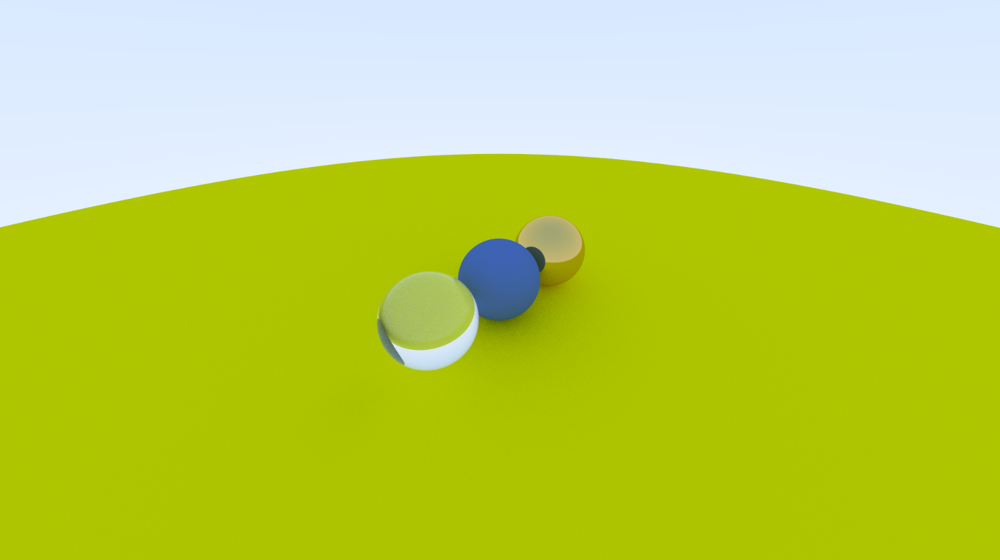
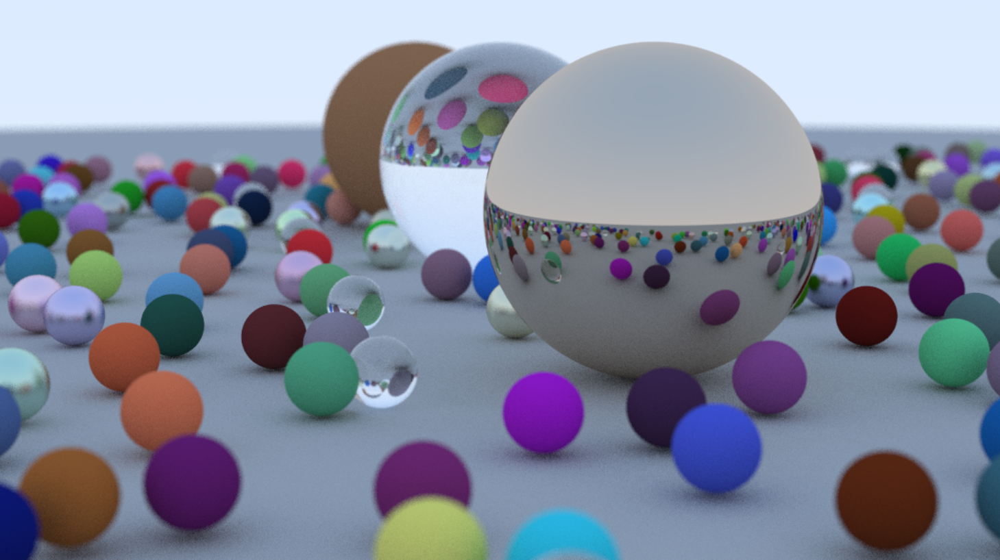

# Raytracer
## Simple (for now) raytracer built in C++ with no external libraries
I am following the [Raytracer in one weekend](https://raytracing.github.io/books/RayTracingInOneWeekend.html) tutorial.  
It's a personal project that serves me two functions: improve my C++ knowledge and improve my practical understanding of Computer Graphics.
  

 
metallic and diffuse materials.
  

 
positionable camera and dielectric (glass) material.
  

 
final render with different sphere of various sizes and materials. Depth of field was also implemented.
    
### TODO
- [ ] Add ray-triangle intersection
- [ ] Add ray-plane intersection
- [ ] Add a way to load external 3D models
- [ ] Add scene interactivity
- [ ] Make it real-time
