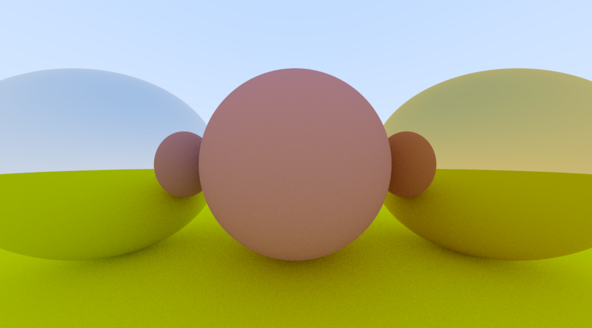

# Raytracer
## Simple (for now) raytracer built in C++ with no external libraries
I am following the [Raytracer in one weekend](https://raytracing.github.io/books/RayTracingInOneWeekend.html) tutorial.  
It's a personal project that serves me two functions: improve my C++ knowledge and improve my understanding of Computer Graphics and Raytracers.
  

